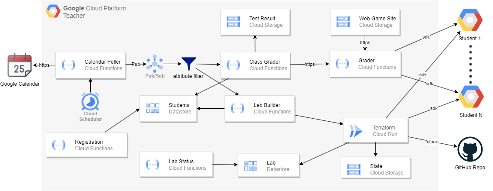

# GCP Lab Engine
When it comes to teaching GCP in a classroom setting, one of the biggest hurdles is managing and evaluating each student's GCP project on a large scale. Fortunately, the GCP Lab Engine offers a solution by automatically grading your students' GCP project resource setup and generating lab environments that align with your class calendar.

(Lab environment generation is still under development.)




## Deployment
Fork this repository and create a Codespace.

### Prerequisite
Set up your gcloud cli and set the default project.

```
gcloud auth login --no-launch-browser
gcloud config set project <PROJECT_ID>
gcloud auth application-default login
```
Install NVM
https://github.com/nvm-sh/nvm


### Deploy GCP resources
```
npm install --global cdktf-cli@latest
cd cdktf
cdktf deploy --auto-approve
```
Note down the static-site-bucket output.


### To build the GCP Adventure Game Application
The application only support node 16 and you need to set the static-site-bucket.

```
export STATICSITEBUCKET=<static-site-bucket>
nvm install 16
nvm use 16
npm i
export PUBLIC_URL=https://storage.googleapis.com/$STATICSITEBUCKET/
npm run build
gsutil rsync -a public-read -r build/ gs://$STATICSITEBUCKET
```


