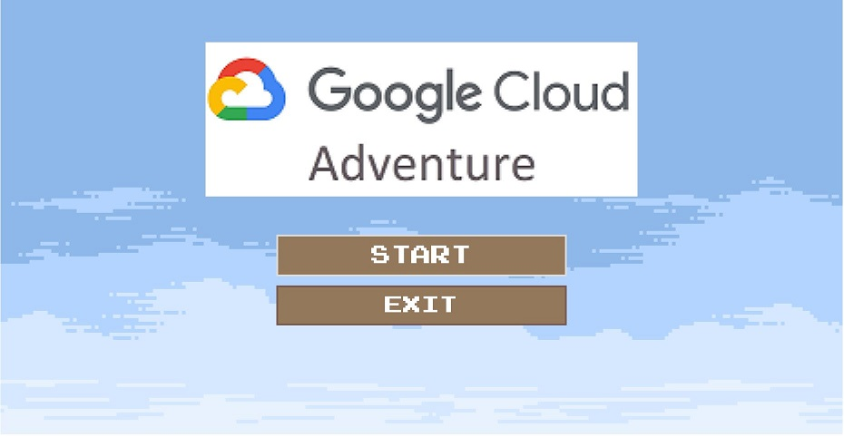

# GCP Lab Engine
When it comes to teaching GCP in a classroom setting, one of the biggest hurdles is managing and evaluating each student's GCP project on a large scale. Fortunately, the GCP Lab Engine offers a solution by automatically grading your students' GCP project resource setup and generating lab environments that align with your class calendar.

(Lab environment generation is still under development.)





## Deployment
Fork this repository and create a Codespace.

### Prerequisite
Set up your gcloud cli and set the default project.

```
gcloud auth login --no-launch-browser
gcloud auth application-default login
```
Install NVM
https://github.com/nvm-sh/nvm


### Deploy GCP resources
```
./deploy.sh
```
It will export infrastructure.json.

### To build the GCP Adventure Game Application

1. Install NVM https://github.com/nvm-sh/nvm#install--update-script

2. The application only support node 16 and you need to set the static-site-bucket.
```
./deploy-game-site.sh 
```


